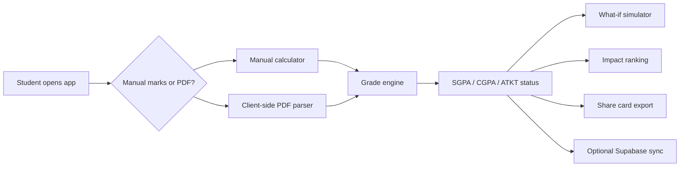

# TCET GradeCalc

<p align="center">
  <strong>The unofficial SGPA/CGPA command center for TCET Mumbai CBCGS-HME 2023 students.</strong>
</p>

<p align="center">
  Calculate grades, parse result PDFs, simulate what-if marks, plan CGPA targets, and turn semester chaos into one clean dashboard.
</p>

<p align="center">
  <a href="https://tcet-gradecalc.vercel.app/"><strong>Live App</strong></a>
  ·
  <a href="https://tcet-gradecalc.vercel.app/#/calculator"><strong>Calculator</strong></a>
  ·
  <a href="#local-setup"><strong>Run Locally</strong></a>
  ·
  <a href="#privacy-first-by-design"><strong>Privacy Notes</strong></a>
</p>

<p align="center">
  
  
  
  
</p>

---

## The Hook

TCET students should not need spreadsheets, screenshots, WhatsApp guesswork, and late-night formula checks just to understand their semester.

**TCET GradeCalc** brings marks, subject templates, parser confidence, what-if analysis, CGPA planning, and shareable result cards into one fast PWA.

It is built for the real student workflow:

1. Enter marks manually or parse a result/gazette PDF.
2. Verify the subject template and parser confidence.
3. See SGPA, CGPA, ATKT risk, and performance breakdown.
4. Simulate what marks are needed next.
5. Save history, compare progress, and share a clean result card.

## Live Demo

| Surface | URL |
| --- | --- |
| Production app | https://tcet-gradecalc.vercel.app/ |
| Calculator route | https://tcet-gradecalc.vercel.app/#/calculator |
| Privacy policy | https://tcet-gradecalc.vercel.app/#/privacy |

## What It Ships

| Feature | What it does | Why students care |
| --- | --- | --- |
| SGPA/CGPA calculator | Computes semester and cumulative grade performance | No spreadsheet formulas |
| Branch-aware subjects | Uses FE subject catalog and verification metadata | Reduces template mistakes |
| IA/ESE/TW/PR engine | Handles internal, end-sem, term work, practical marks | Matches real mark components |
| ATKT detection | Flags risky subjects and failure states | Makes danger visible early |
| Result PDF parser | Extracts structured marks client-side with `pdfjs-dist` | Faster than manual entry |
| Office Register parser | Handles branch/semester/cycle-aware templates | Supports official-style records |
| What-if simulator | Tests marks before results are final | Helps plan realistic targets |
| Impact ranking | Shows which subjects move SGPA most | Focus where it matters |
| Target calculator | Calculates needed performance for goals | Turns "I need 8+" into numbers |
| CGPA planner | Tracks long-term academic trajectory | Useful beyond one semester |
| Share card export | PNG/PDF result cards via `html2canvas` and `jspdf` | Easy to share without messy screenshots |
| Supabase sync | Optional profile/history/leaderboard flow | Keeps progress across devices |
| Guest mode | LocalStorage persistence without login | Fast start, no signup wall |
| PWA shell | Offline fallback and installable app feel | Works like a student utility should |

## Why This Is Different

Most calculators stop at "enter marks, get SGPA." TCET GradeCalc goes deeper:

- It treats branch/semester/cycle differences as subject-template differences.
- It separates manual marks from official parsed results.
- It stores parser confidence metadata so users know when to verify.
- It avoids uploading raw PDFs by default.
- It includes planner tools, not just calculators.
- It keeps guest mode alive even with optional Supabase auth.

## Product Flow



## Tech Stack

| Layer | Stack |
| --- | --- |
| UI | React 19, Vite, Tailwind CSS |
| Routing | React Router |
| State | Zustand |
| Charts | Recharts |
| PDF parsing | pdfjs-dist |
| Export | html2canvas, jsPDF |
| Backend sync | Supabase |
| PWA | Manifest + service worker |
| Hosting | Vercel, Netlify, GitHub Pages-compatible |

## Privacy First By Design

Student result data is sensitive. This project is intentionally conservative:

- Raw PDFs are parsed locally in the browser.
- Raw PDFs are not uploaded by default.
- Full raw extracted text is not saved by default.
- Only confirmed structured marks/profile data are saved to Supabase.
- Leaderboard participation is opt-in.
- Names are masked by default in leaderboard-style views.

Read more:

- [`PRIVACY.md`](./PRIVACY.md)
- [`DISCLAIMER.md`](./DISCLAIMER.md)
- [`PARSER_NOTES.md`](./PARSER_NOTES.md)

## Local Setup

```bash
npm install
npm run dev -- --host 127.0.0.1
```

Open:

```txt
http://127.0.0.1:5173/
```

## Validation

```bash
npm run lint
npm run build
npm test
```

## Environment Variables

Set these in `.env.local` and in your hosting platform:

```bash
VITE_SUPABASE_URL=
VITE_SUPABASE_ANON_KEY=
VITE_AUTH_REDIRECT_URL=
VITE_TCET_ALLOWED_EMAIL_DOMAINS=tcetmumbai.in
```

## Supabase Setup

1. Run `supabase/schema.sql` for a fresh project.
2. Enable Google auth for production.
3. Keep Email magic link as a fallback.
4. Add redirect URLs:
   - `http://127.0.0.1:5173/`
   - `http://localhost:5173/`
   - your LAN URL for phone testing
   - production URL
5. Keep guest mode available for fast access.

Production auth strategy:

- Google OAuth is the primary sign-in path.
- Email magic link remains a fallback.
- Guest mode always stays available.
- If email login remains enabled in production, use custom SMTP rather than the default Supabase email quota.

## Deployment

### Vercel

```bash
npm run build
```

Output directory:

```txt
dist
```

### Netlify

- Build command: `npm run build`
- Publish directory: `dist`
- SPA redirects file already exists at `public/_redirects`

### GitHub Pages

The workflow can build with:

```bash
VITE_BASE_PATH=/<repo-name>/
```

Keep `HashRouter` and add the Pages URL to Supabase redirect URLs.

## Extra Docs

- [`LAUNCH_CHECKLIST.md`](./LAUNCH_CHECKLIST.md)
- [`PARSER_NOTES.md`](./PARSER_NOTES.md)
- [`SUPABASE_SETUP.md`](./SUPABASE_SETUP.md)
- [`PRIVACY.md`](./PRIVACY.md)
- [`DISCLAIMER.md`](./DISCLAIMER.md)

## Roadmap Ideas

- More branch templates
- More official-result parser fixtures
- Better mobile result-card export
- Student-safe anonymous benchmark mode
- Semester-by-semester academic recovery planner
- Admin verification panel for parser templates

## Disclaimer

This is an unofficial student utility. Always verify final academic results with official TCET/University records.

If this helped you survive result season, star the repo and share it with your batch.
