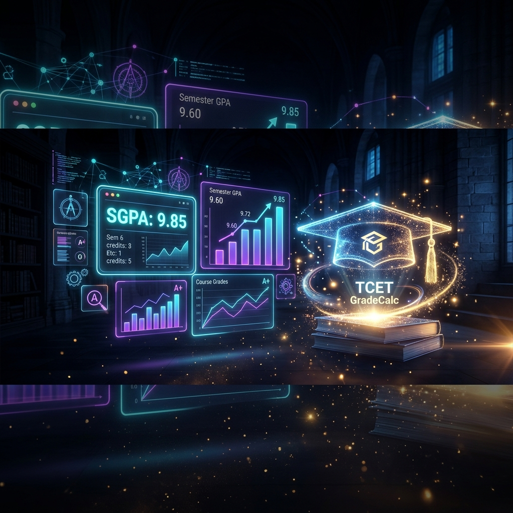
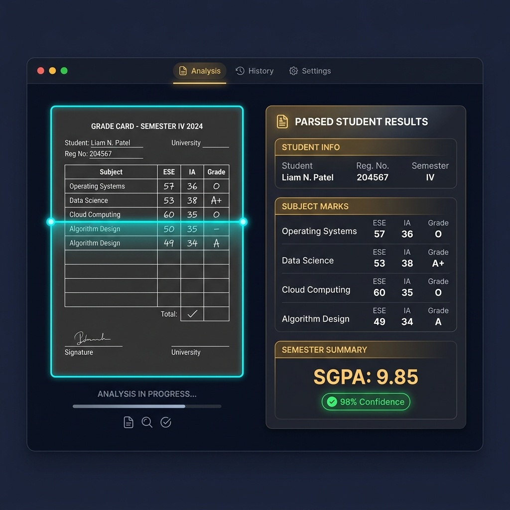

<p align="center">
  
</p>

<div align="center">

# 🎓 TCET GradeCalc

### *Your SGPA calculation era starts now.*

[](https://tcet-gradecalc.vercel.app/)

<br/>


<br/>

**Upload PDF** · **Instant SGPA** · **Zero Manual Entry** · **100% Private** · **Works Offline**

<br/>

[**🚀 Live Demo**](https://tcet-gradecalc.vercel.app/) · [**📖 Docs**](#-documentation) · [**🐛 Report Bug**](https://github.com/mitanshj07/tcet-gradecalc/issues) · [**💡 Request Feature**](https://github.com/mitanshj07/tcet-gradecalc/issues)

</div>

<br/>

---

<br/>

## 💀 The Problem

> *It's 2 AM. Results just dropped. You're squinting at a 50-column gazette PDF on your phone, trying to calculate your SGPA with a phone calculator. You accidentally close the tab. You start over. You get a different number. You question your existence.*

**Sound familiar?** Yeah. We fixed that.

<br/>

## ⚡ The Solution

<p align="center">
  
</p>

<div align="center">

### Upload your gazette PDF. Get your SGPA in 2 seconds. That's it.

</div>

No manual entry. No squinting. No mistakes. No stress.

The parser reads every single mark from your official TCET gazette, mathematically validates every cell, and gives you a confidence-scored result. If something looks off, it tells you exactly what and lets you fix it.

**Your PDF never leaves your phone.** Everything is parsed locally in your browser. We literally cannot see your marks even if we wanted to.

<br/>

---

<br/>

## 🔥 Feature Showcase

<div align="center">

### 🧠 The PDF Parser Engine

*This isn't a text extractor. This is a full mathematical verification system.*

</div>

```
╔══════════════════════════════════════════════════════════════════════╗
║                                                                      ║
║   📄 Upload PDF                                                      ║
║      │                                                               ║
║      ▼                                                               ║
║   🔍 Text Extraction (PDF.js v3 — CDN loaded, no bundler issues)     ║
║      │                                                               ║
║      ▼                                                               ║
║   🧬 Branch/Semester/Cycle Auto-Detection                            ║
║      │   ├─ Detects all 11 TCET branches                            ║
║      │   ├─ Identifies Physics vs Chemistry cycle                    ║
║      │   └─ Maps to correct subject template                        ║
║      ▼                                                               ║
║   📊 Token-Block Parser                                              ║
║      │   ├─ Extracts: ESE, IA, TW, PR, Oral, Total                 ║
║      │   ├─ Extracts: Grade, GP, Credits, CP                        ║
║      │   └─ Handles multi-line names, ATKT, female markers          ║
║      ▼                                                               ║
║   ✅ Mathematical Validation                                         ║
║      │   ├─ ESE + IA = Total           ✓                            ║
║      │   ├─ Grade ↔ GP mapping         ✓                            ║
║      │   ├─ GP × Credits = CP          ✓                            ║
║      │   ├─ Σ(CP) / Σ(C) = SGPA       ✓                            ║
║      │   └─ Each field gets confidence score                        ║
║      ▼                                                               ║
║   🎯 Result: SGPA with 98% confidence                               ║
║                                                                      ║
╚══════════════════════════════════════════════════════════════════════╝
```

<br/>

### 📱 Everything Else (Yes, It Does All This Too)

<table>
<tr>
<td width="33%" valign="top">

#### 🧮 Smart Calculator
- ISE1 + ISE2 + ISE3 → Auto IA
- All component types (ESE/TW/PR/Oral)
- Real-time SGPA as you type
- ATKT detection per head
- Supports all 11 branches × 2 semesters × 2 cycles

</td>
<td width="33%" valign="top">

#### 📈 What-If Simulator
- *"What if I scored 5 more in ESE?"*
- *"Which subject impacts SGPA most?"*
- *"What marks for 9.0 SGPA?"*
- CGPA planner across 8 semesters
- Interactive Recharts visualizations

</td>
<td width="33%" valign="top">

#### 🏆 Leaderboard
- 100% opt-in (privacy first)
- Names masked by default
- Filter: branch / semester / batch
- Live average & highest SGPA
- TCET email verification badge

</td>
</tr>
<tr>
<td width="33%" valign="top">

#### 🔐 Auth & Sync
- Google OAuth (primary)
- Email magic link (fallback)
- Guest mode (zero signup!)
- Cloud sync via Supabase
- Row-Level Security on everything

</td>
<td width="33%" valign="top">

#### 🎨 Share Cards
- PNG screenshot export
- PDF report generation
- One-tap WhatsApp/Instagram share
- Beautiful glassmorphism design
- Dark mode only (as it should be)

</td>
<td width="33%" valign="top">

#### 📱 Works Everywhere
- Android Chrome ✅
- iOS Safari ✅
- Desktop browsers ✅
- ES2015 build target
- PWA installable
- Offline capable

</td>
</tr>
</table>

<br/>

---

<br/>

## 🏗️ System Architecture

```
                              ┌──────────────────────┐
                              │     User's Phone     │
                              │  (PDF never leaves)  │
                              └──────────┬───────────┘
                                         │
                    ┌────────────────────┐│┌────────────────────┐
                    │                    │││                    │
               ┌────▼────┐         ┌────▼▼▼──┐          ┌─────▼────┐
               │ Landing │         │ Calcul- │          │ Analysis │
               │  Page   │         │  ator   │          │  Page    │
               └────┬────┘         └────┬────┘          └────┬─────┘
                    │                   │                     │
                    └───────────┬───────┴─────────────────────┘
                                │
                    ┌───────────▼───────────┐
                    │    Zustand Store      │
                    │  ┌─────┬──────┬────┐  │
                    │  │marks│profile│hist│  │
                    │  └─────┴──────┴────┘  │
                    └───────────┬───────────┘
                                │
          ┌─────────────────────┼─────────────────────┐
          │                     │                     │
   ┌──────▼──────┐      ┌──────▼──────┐      ┌──────▼──────┐
   │  PDF.js     │      │  Office     │      │  Grading    │
   │  (CDN)      │      │  Register   │      │  Engine     │
   │  Extract    │─────▶│  Parser     │─────▶│  (CBCGS)    │
   └─────────────┘      └──────┬──────┘      └──────┬──────┘
                               │                     │
                    ┌──────────▼─────────┐           │
                    │   11 Branch        │           │
                    │   Templates        │           │
                    │   × 2 Semesters    │           │
                    │   × 2 Cycles       │           │
                    │   = 44 Templates   │           │
                    └────────────────────┘           │
                                                     │
                    ┌────────────────────────────────▼┐
                    │         Supabase                 │
                    │  ┌──────────┐ ┌──────────────┐  │
                    │  │ profiles │ │semester_results│ │
                    │  └──────────┘ └──────────────┘  │
                    │  ┌──────────┐ ┌──────────────┐  │
                    │  │  marks   │ │ leaderboard  │  │
                    │  └──────────┘ │   (view)     │  │
                    │               └──────────────┘  │
                    │     🔒 Row Level Security 🔒     │
                    └─────────────────────────────────┘
```

<br/>

---

<br/>

## 🛠️ Tech Stack

<div align="center">

| | Technology | Why |
|:--:|:--|:--|
| ⚛️ | **React 19** | Blazing fast UI with latest features |
| ⚡ | **Vite 8** | Sub-second HMR, instant builds |
| 🐻 | **Zustand** | Tiny, powerful state management |
| 🎨 | **Vanilla CSS** | Glassmorphism dark theme, zero bloat |
| 📊 | **Recharts** | Beautiful interactive charts |
| 📄 | **PDF.js 3.11** | Universal PDF parsing (CDN-loaded) |
| 🔐 | **Supabase** | Auth + DB + RLS in one |
| 🧪 | **Vitest** | 68 tests, fast and reliable |
| 📸 | **html2canvas** | Screenshot-quality share cards |
| 📋 | **jsPDF** | PDF report generation |

</div>

<br/>

---

<br/>

## ⚡ Quick Start

<details open>
<summary><h3>🚀 Get running in 60 seconds</h3></summary>

```bash
# 1. Clone it
git clone https://github.com/mitanshj07/tcet-gradecalc.git
cd tcet-gradecalc

# 2. Install dependencies
npm install

# 3. Set up environment
cat > .env.local << EOF
VITE_SUPABASE_URL=https://your-project.supabase.co
VITE_SUPABASE_ANON_KEY=your-anon-key
VITE_AUTH_REDIRECT_URL=http://127.0.0.1:5173/
VITE_TCET_ALLOWED_EMAIL_DOMAINS=tcetmumbai.in
EOF

# 4. Launch! 🚀
npm run dev
```

Open **http://127.0.0.1:5173/** — you're live!

</details>

<details>
<summary><h3>🗄️ Supabase Setup</h3></summary>

1. Create a free project at [supabase.com](https://supabase.com)
2. Go to **SQL Editor** → **New Query**
3. Paste contents of `supabase/schema.sql` → **Run**
4. Go to **Authentication** → **Providers** → Enable **Google**
5. Add redirect URLs:
   ```
   http://127.0.0.1:5173/
   http://localhost:5173/
   https://your-app.vercel.app/
   ```

**That's it.** Your database, auth, leaderboard, and RLS policies are all set up.

</details>

<details>
<summary><h3>📱 Testing on Phone (LAN)</h3></summary>

```bash
# Start with host flag
npm run dev -- --host 0.0.0.0

# Find your IP
ipconfig getifaddr en0  # macOS
```

Set `VITE_AUTH_REDIRECT_URL=http://YOUR_IP:5173/` in `.env.local` and add it to Supabase redirect URLs.

</details>

<br/>

---

<br/>

## 🧪 Test Suite

```bash
npm test
```

```
 ✓ src/utils/grading.test.js          (35 tests)  ████████████████████  ✅
 ✓ src/utils/officeRegisterParser.test (20 tests)  ████████████         ✅
 ✓ src/utils/authRedirect.test.js      ( 5 tests)  ███                  ✅
 ✓ src/utils/authDomains.test.js       ( 3 tests)  ██                   ✅
 ✓ src/utils/privacy.test.js           ( 3 tests)  ██                   ✅
 ✓ src/utils/gazetteTest.test.js       ( 2 tests)  █                    ✅

 Test Files  6 passed (6)
      Tests  68 passed (68)                        100% PASS RATE 🎯
```

<br/>

---

<br/>

## 📋 All 11 Branches Supported

<div align="center">

| | Branch | Code | Physics Cycle | Chemistry Cycle |
|:--:|:--|:--:|:--:|:--:|
| 🤖 | AI & Data Science | `AIDS` | ✅ | ✅ |
| 🧠 | AI & Machine Learning | `AIML` | ✅ | ✅ |
| 💻 | Computer Engineering | `COMP` | ✅ | ✅ |
| 🌐 | Information Technology | `IT` | ✅ | ✅ |
| 🖥️ | Computer Science & Engg | `CSE` | ✅ | ✅ |
| ⚡ | Electronics & Computer Sci | `ECS` | ✅ | ✅ |
| 📡 | IoT | `IOT` | ✅ | ✅ |
| 📻 | EXTC | `EXTC` | ✅ | ✅ |
| ⚙️ | Mechanical | `MECH` | ✅ | ✅ |
| 🏗️ | Civil | `CIVIL` | ✅ | ✅ |
| 🔬 | Metallurgy & Materials | `MME` | ✅ | ✅ |

**= 44 unique subject templates** (11 branches × 2 semesters × 2 cycles)

</div>

<br/>

---

<br/>

## 🔒 Privacy — We Take This Seriously

<div align="center">

| 🔒 | What | How |
|:--:|:--|:--|
| 📄 | **Your PDF** | Parsed **locally in your browser**. Never uploaded. We physically cannot see it. |
| 📝 | **Raw Text** | Never saved anywhere. Exists only in browser memory during parsing. |
| 💾 | **Saved Marks** | Only stored if YOU click "Save". Encrypted in transit. RLS-protected. |
| 🏆 | **Leaderboard** | 100% opt-in. Names masked by default. You control visibility. |
| 🔑 | **Database** | Row-Level Security. You literally cannot query another user's data. |
| 👤 | **Guest Mode** | Use everything without ever making an account. Data stays in localStorage. |

</div>

<br/>

---

<br/>

## 🚀 One-Click Deploy

<div align="center">

[](https://vercel.com/new/clone?repository-url=https%3A%2F%2Fgithub.com%2Fmitanshj07%2Ftcet-gradecalc&env=VITE_SUPABASE_URL,VITE_SUPABASE_ANON_KEY,VITE_AUTH_REDIRECT_URL)

[](https://app.netlify.com/start/deploy?repository=https://github.com/mitanshj07/tcet-gradecalc)

</div>

<br/>

---

<br/>

## 🤝 Contributing

We love contributions! Whether it's a bug fix, new feature, or documentation improvement — every PR is welcome.

```bash
# Fork → Clone → Branch → Code → Push → PR

git checkout -b feature/your-amazing-feature
git commit -m "feat: add your amazing feature"
git push origin feature/your-amazing-feature
```

### 💡 Contribution Ideas

| Difficulty | Idea |
|:--|:--|
| 🟢 Easy | Add more branch subject templates (SE Semesters 3-8) |
| 🟢 Easy | Multi-language support (Hindi, Marathi) |
| 🟡 Medium | Historical SGPA trend analysis & predictions |
| 🟡 Medium | Result notification system |
| 🔴 Hard | React Native mobile app |
| 🔴 Hard | OCR support for scanned/image PDFs |

<br/>

---

<br/>

## 📖 Documentation

| Document | Description |
|:--|:--|
| 📋 [`LAUNCH_CHECKLIST.md`](LAUNCH_CHECKLIST.md) | Pre-launch verification checklist |
| 🔬 [`PARSER_NOTES.md`](PARSER_NOTES.md) | Deep technical dive into the parser engine |
| 🗄️ [`SUPABASE_SETUP.md`](SUPABASE_SETUP.md) | Complete Supabase configuration guide |
| 🔒 [`PRIVACY.md`](PRIVACY.md) | Privacy policy |
| ⚖️ [`DISCLAIMER.md`](DISCLAIMER.md) | Legal disclaimer |

<br/>

---

<br/>

<div align="center">

## ⭐ If This Saved You From Manual SGPA Pain...

### Give it a star. You know you want to. ⭐

<br/>

[](https://github.com/mitanshj07/tcet-gradecalc)

<br/>

Every star tells us *"Hey, this actually helped."*

And honestly? That's why we built it.

<br/>

---

<br/>

<sub>

**Built with ❤️ and way too much chai by TCET students, for TCET students.**

This is an unofficial tool. Not affiliated with or endorsed by TCET Mumbai.

But let's be real — they should be taking notes. 😏

</sub>

<br/>

[](https://tcet-gradecalc.vercel.app/)

</div>
